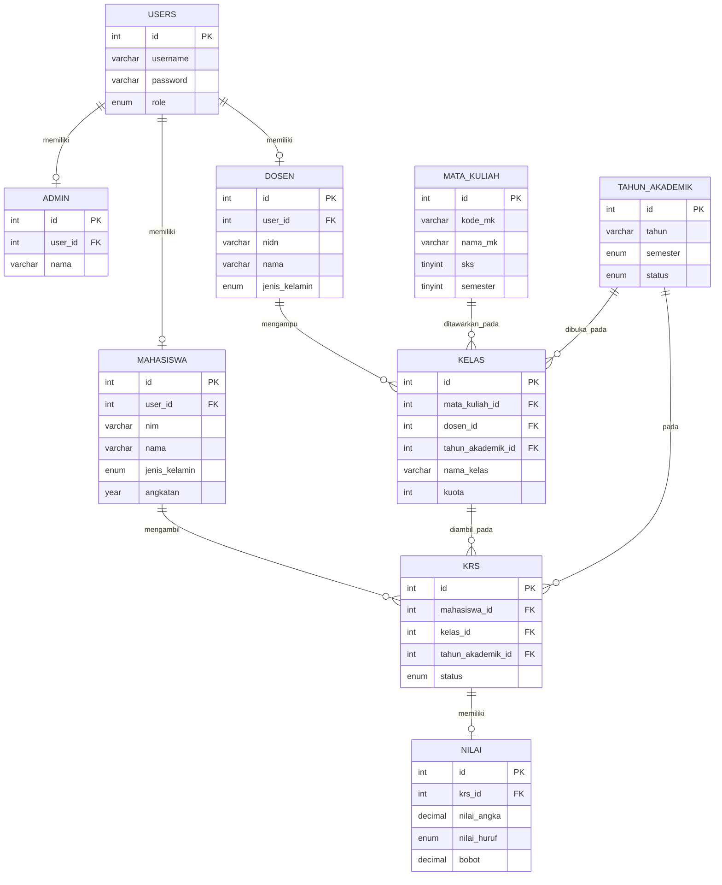
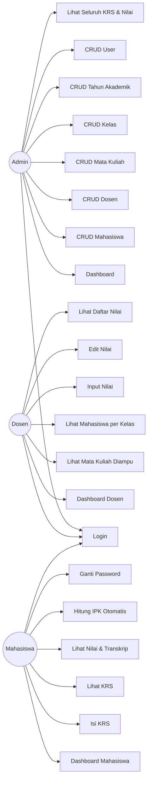
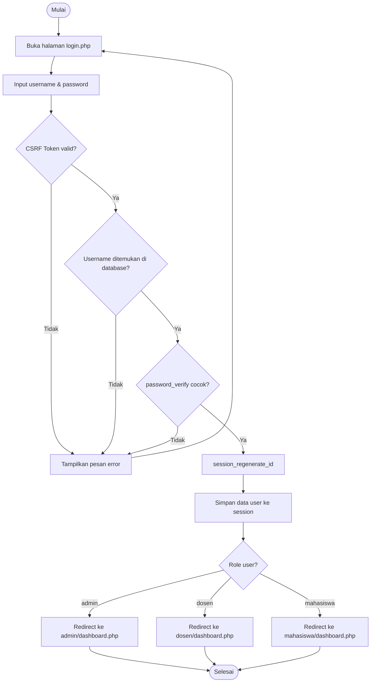

# Sistem Informasi Akademik Sederhana

Proyek UAS Pemrograman Internet — Sistem Informasi Akademik (SIA) sederhana berbasis **PHP Native** (tanpa framework), **MySQL**, dan **Bootstrap 5**. Mendukung tiga role pengguna: **Admin**, **Dosen**, dan **Mahasiswa**.

---

## 📋 Daftar Isi

- [Teknologi](#-teknologi)
- [Fitur](#-fitur)
- [Struktur Folder](#-struktur-folder)
- [ERD (Entity Relationship Diagram)](#-erd-entity-relationship-diagram)
- [Use Case Diagram](#-use-case-diagram)
- [Flowchart Login](#-flowchart-login)
- [Cara Instalasi](#-cara-instalasi)
- [Cara Import Database](#-cara-import-database)
- [Cara Menjalankan di XAMPP](#-cara-menjalankan-di-xampp)
- [Akun Default](#-akun-default)
- [Penjelasan Folder](#-penjelasan-folder)

---

## 🛠 Teknologi

| Layer | Teknologi |
|---|---|
| Backend | PHP Native (tanpa framework), PDO, Prepared Statement |
| Frontend | HTML5, CSS3, JavaScript, Bootstrap 5, Bootstrap Icons |
| Database | MySQL (dijalankan via XAMPP) |
| Keamanan | password_hash/password_verify, CSRF Token, Session, Prepared Statement |

## ✨ Fitur

**Admin:** Login, Dashboard, CRUD Mahasiswa/Dosen/Mata Kuliah/Kelas/Tahun Akademik/User, melihat seluruh KRS & Nilai, pencarian, pagination.

**Dosen:** Login, Dashboard, melihat mata kuliah diampu, melihat mahasiswa per kelas, input nilai, edit nilai, melihat daftar nilai.

**Mahasiswa:** Login, Dashboard, mengisi KRS, melihat KRS, melihat nilai & transkrip, menghitung IPK otomatis, mengubah password.

---

## 📁 Struktur Folder

```
uas-sia/
├── assets/
│   ├── css/            # File CSS kustom (style.css)
│   ├── js/             # File JavaScript (main.js, login.js)
│   └── images/         # Aset gambar
├── config/
│   ├── config.php      # Konfigurasi aplikasi (session, timezone, BASE_URL)
│   └── database.php    # Koneksi database PDO (class Database, singleton)
├── database/
│   └── database.sql    # Skema database lengkap + data dummy
├── includes/
│   ├── auth.php        # Fungsi requireLogin(), requireRole(), redirectToDashboard()
│   ├── functions.php   # Helper umum: flash message, validasi, pagination, hitung nilai
│   ├── header.php      # Bagian <head> + navbar atas (dipakai semua dashboard)
│   ├── sidebar.php     # Sidebar navigasi dinamis sesuai role
│   └── footer.php      # Penutup halaman + script bundle
├── admin/               # Seluruh halaman & proses untuk role Admin
├── dosen/               # Seluruh halaman & proses untuk role Dosen
├── mahasiswa/            # Seluruh halaman & proses untuk role Mahasiswa
├── auth/
│   └── proses_login.php # Verifikasi login (CSRF, password_verify, session)
├── uploads/              # Folder upload (foto profil, dsb - saat ini kosong)
├── index.php             # Entry point, redirect ke login/dashboard
├── login.php              # Halaman login
├── logout.php             # Proses logout
├── .htaccess               # Kompresi & cache (Apache)
├── database.sql              # (lihat folder database/)
└── README.md
```

---

## 🗄 ERD (Entity Relationship Diagram)



---

## 👤 Use Case Diagram



---

## 🔐 Flowchart Login



---

## 🚀 Cara Instalasi

1. Pastikan **XAMPP** (Apache + MySQL + PHP 8.1+) sudah terpasang di komputer Anda.
2. Clone atau salin seluruh folder proyek ini ke dalam folder `htdocs` XAMPP, contoh:
   ```
   C:\xampp\htdocs\uas-sia\        (Windows)
   /Applications/XAMPP/htdocs/uas-sia/   (Mac)
   ```
3. Buka XAMPP Control Panel, jalankan service **Apache** dan **MySQL**.

## 🗃 Cara Import Database

1. Buka browser, akses **phpMyAdmin** di `http://localhost/phpmyadmin`.
2. Buat database baru bernama `db_sia` (atau langsung import, karena `database.sql` sudah berisi perintah `CREATE DATABASE IF NOT EXISTS`).
3. Klik tab **Import**, pilih file `database/database.sql`, lalu klik **Go**.
4. Atau via command line:
   ```bash
   mysql -u root -p db_sia < database/database.sql
   ```
5. Database akan otomatis terisi skema lengkap (9 tabel + foreign key) beserta data dummy (1 admin, 5 dosen, 20 mahasiswa, 10 mata kuliah, 5 kelas, 100 KRS, 100 nilai).

## ▶️ Cara Menjalankan di XAMPP

1. Pastikan konfigurasi database di `config/database.php` sesuai dengan environment Anda (default: host `localhost`, user `root`, password kosong — sesuai default XAMPP).
2. Buka browser, akses:
   ```
   http://localhost/uas-sia/
   ```
3. Anda akan diarahkan otomatis ke halaman login.
4. Login menggunakan salah satu [akun default](#-akun-default) di bawah.

---

## 🔑 Akun Default

Semua akun dummy menggunakan password: **`password123`**

| Role | Username | Keterangan |
|---|---|---|
| Admin | `admin` | Administrator Utama |
| Dosen | `dosen1` s/d `dosen5` | 5 akun dosen dummy |
| Mahasiswa | `20230001` s/d `20230020` | NIM sebagai username, 20 akun mahasiswa dummy |

> Untuk data yang dibuat lewat aplikasi (bukan dummy awal), username dosen baru = NIDN, username mahasiswa baru = NIM, dengan password default yang sama (`password123`).

---

## 📂 Penjelasan Folder

| Folder/File | Penjelasan |
|---|---|
| `assets/` | Semua aset frontend: CSS kustom, JavaScript, dan gambar. |
| `config/` | Konfigurasi aplikasi (session, timezone, BASE_URL) dan koneksi database PDO. |
| `database/` | Berisi `database.sql` — skema lengkap database beserta data dummy. |
| `includes/` | Komponen yang dipakai berulang: header, sidebar, footer, fungsi autentikasi, dan helper umum (flash message, validasi, pagination, perhitungan nilai). |
| `admin/` | Seluruh halaman dan proses backend khusus role Admin (dashboard + 6 modul CRUD). |
| `dosen/` | Seluruh halaman dan proses backend khusus role Dosen (dashboard, mata kuliah, input/edit nilai). |
| `mahasiswa/` | Seluruh halaman dan proses backend khusus role Mahasiswa (dashboard, KRS, nilai, ganti password). |
| `auth/` | Proses verifikasi login (terpisah dari tampilan `login.php`). |
| `uploads/` | Folder untuk menyimpan file upload (misalnya foto profil di masa mendatang). |
| `index.php` | Entry point aplikasi — redirect ke login atau dashboard sesuai status session. |
| `login.php` / `logout.php` | Halaman login dan proses logout. |
| `.htaccess` | Konfigurasi Apache untuk kompresi GZIP dan cache aset statis. |

---

## 👨‍💻 Dikembangkan Sebagai

Proyek UAS mata kuliah Pemrograman Internet — dibangun secara bertahap (30 tahap pengembangan, >25 commit Git) untuk mensimulasikan proses pengembangan perangkat lunak profesional dari nol hingga siap pakai.
